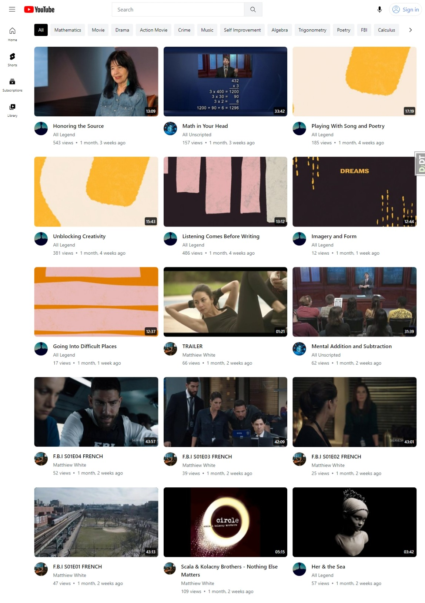

# flx-youtube (YouTube Clone)

I. Introduction
  1. Purpose
     The purpose of this document is to define the requirements for the development of a video-sharing platform similar to YouTube.
  2. Scope
     The platform will allow users to upload, view, share and comment on video. It will also include features for user accounts, subscriptions and content discovery.
  3. Architectures
     This platform will be developped using HTML, CSS and Javascript for the front end. Django for the backend, PostgreSQL for content storage and retrieval as well as Redis for views.

II. Overall Description
  1. Product Perspective
    The video-sharing platform will be a standalone web application with a database backend.
  2. Product Features
    1. User registration and authentication
    2. Video upload and management
    3. Video playback and streaming
    4. Content discovery through recommendations and search
    5. Commenting and social interactions.
 3. User Classes and Characteristics
    1. **Guest Users**: Users who browse the platform without logging in.
    2. **Registered Users**: Users with accounts, enabling features like video uploads and subscriptions.
    3. **Content Creators**: Users who upload videos.
    4. **Administrators**: Manage user accounts, content moderation, and platform settings

